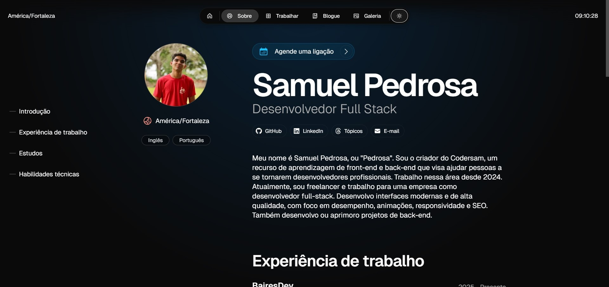

# My portifolip

Magic Portfolio is a simple, clean, beginner-friendly portfolio template. It supports an MDX-based content system for projects and blog posts, an about / CV page and a gallery.




## Getting started

**1. Clone the repository**
```
git clone 
```

**2. Install dependencies**
```
npm install
```

**3. Run dev server**
```
npm run dev
```

**4. Edit config**
```
src/resources/once-ui.config.js
```

**5. Edit content**
```
src/resources/content.js
```

**6. Create blog posts / projects**
```
Add a new .mdx file to src/app/blog/posts or src/app/work/projects
```

My portifolio was built with [Once UI](https://once-ui.com) for [Next.js](https://nextjs.org). It requires Node.js v18.17+.


## Features

### Once UI
- All tokens, components & features of [Once UI](https://once-ui.com)

## License

Distributed under the CC BY-NC 4.0 License.


See `LICENSE.txt` for more information.

## Deploy with Vercel


